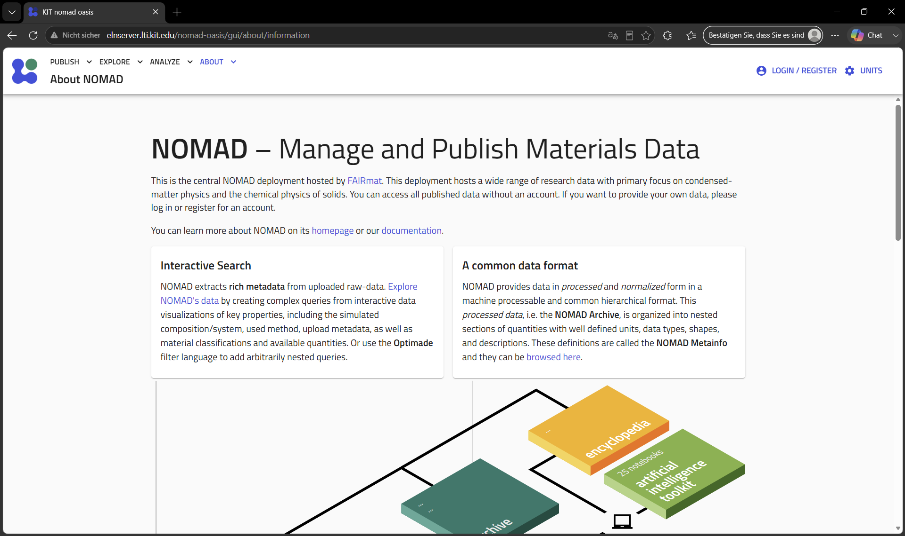

# NOMAD Electronic Laboratory Notebook

The NOMAD ELN enables structured documentation, metadata management, long-term preservation of scientific research data and a Jupyter base wherre measurement data can be evaluated directly.

{ .shadow width="1100" }

*NOMAD Dashboard interface:* [Go to OASIS](http://elnserver.lti.kit.edu/nomad-oasis/gui/about/information){ .md-button .md-button--primary target="_blank" rel="noopener noreferrer"}

## Key Features

-   :material-flask-outline:

    **Experiments**

    Document laboratory work in a structured way with digital twins of laboratory equipment.

-   :material-upload:

    **Uploads**

    Upload your experimental plans and measured raw data and get them mapped automatically.

-   :material-tag:

    **Metadata**

    Access and enrich metadata extracted from files. Built-in parsers automatically extract and structure experimental informations.

-   :material-chart-line:

    **Data Analysis**

    Visualize, plot, and download your experimental data with the data analysis done on the NOMAD Oasis.

-   :material-share-variant:

    **Share Data**

    Quickly share datasets within your research group to compare results and compare the quality of machines and users.

-   :material-publish:

    **Publication**

    Prepare FAIR datasets for long-term storage and scientific publication.

---

# Why do we use an ELN: Legal Framework & Background for ELNs at German Universities

## Executive Summary
There is no direct statutory law in Germany mandating the use of specific software (such as an ELN). However, universities and researchers are bound by a dense network of state laws, funding agency requirements, and academic codes of conduct. These regulations legally require research data to be documented in an **audit-proof, retrievable, and structured** manner. Given the massive scale of modern digital raw data, fulfilling these legal requirements using traditional paper lab notebooks is practically impossible.

---

## 1. The Core of Academic Law: Good Scientific Practice (GWP)
The German Research Foundation (*Deutsche Forschungsgemeinschaft - DFG*) has established binding guidelines in its *Code of Conduct: Guidelines for Safeguarding Good Scientific Practice*. Almost all German universities have legally adopted this code into their internal university statutes and regulations.

* **Guideline 17 (Archiving):** Research data, raw data, and reports must be stored on secure infrastructure within the institution for at least **10 years**.
* **Traceability & Verifiability:** Every scientific result must be fully reproducible. Unlike a paper notebook, an ELN provides an automated version history (`Audit Trail`). This ensures that any deletions, modifications, or subsequent manipulations are technically impossible to hide and can be easily verified.
* **Sanctions:** Violations of GWP guidelines constitute scientific misconduct. This can result in severe consequences, including the revocation of academic degrees, termination of employment, or a ban from future grant funding.

---

## 2. Statutory Regulations & State Higher Education Laws
The overarching legal framework is defined by federal and state laws governing the organization and public duties of universities.

* **State Higher Education Acts (*Landeshochshulgesetze - LHG*):** State university laws increasingly mandate that universities implement professional Research Data Management (RDM). As public-law corporations, universities are legally required to guarantee a transparent and traceable documentation of research funded by taxpayers.
* **State Archive Laws (*Landesarchivgesetze*):** Legally, research data generated at universities is often classified as state archival material. There is a statutory duty to properly manage, index, and protect these files from deterioration or loss.

---

## 3. Legal Obligations Under Third-Party Funding
Modern university research heavily relies on external funding. The allocation of these public and private funds is tied to strict contractual obligations:

| Funding Body | Data Governance Requirements | Role of the ELN |
| :--- | :--- | :--- |
| **DFG (German Research Foundation)** | Mandatory Data Management Plan (DMP) at the proposal stage. Proof of long-term data preservation. | Central repository for protocols, directly linked to electronic raw data and instruments. |
| **EU (Horizon Europe)** | Strict mandate for *Open Science* and compliance with the **FAIR Principles** (*Findable, Accessible, Interoperable, Reusable*). | Standardized interfaces and open export formats enable global interoperability. |
| **BMBF / Federal Ministries** | Verification audits of usage. Absolute proof of correct execution of the funded project. | Audit-proof documentation of project progress protects the university from funding clawbacks. |

---

## 4. Liability, Patent Law, and Intellectual Property
In industrial collaborations or during patent application processes, the legal certainty of documentation becomes critical:

* **Proof of Invention (*Arbeitnehmererfindergesetz - ArbnErfG*):** University employees are legally required to report inventions immediately. An ELN equipped with digital time-stamps (e.g., RFC 3161 compliant) provides an exact, court-admissible proof of priority (*Who made the discovery at what exact millisecond?*).
* **Liability Protection:** If a publication is challenged regarding potential plagiarism or data manipulation, the ELN serves as the ultimate legal protection for both the individual lab and the university.

---

## 5. Data Privacy & IT Security (GDPR & BSI)
Whenever university research involves human subjects (particularly in medicine, clinical trials, or psychology), the **General Data Protection Regulation (GDPR)** applies. ELNs support compliance through:
* Strict, role-based access control (granular read/write permissions).
* Secure encryption for data both in transit and at rest.
* Systematic deletion concepts (the *Right to be Forgotten*), provided they do not conflict with GWP archiving laws.