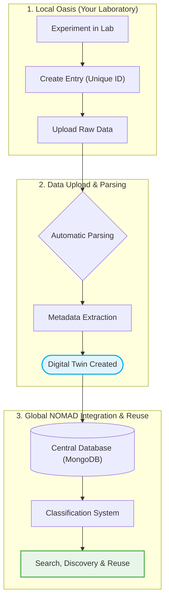

# How does the ELN Work? 

# NOMAD Oasis – System Architecture & Workflow

The NOMAD ecosystem is built around a distributed structure of **local NOMAD Oasis instances** and a **global NOMAD infrastructure**.

Each laboratory or institution operates its own Oasis, while data can optionally be shared and integrated into the global NOMAD database.

---

## NOMAD Oasis Workflow


---

## How the System Works

### 1. Local Oasis (Your Laboratory)

Each research group operates an independent NOMAD Oasis instance.

Here researchers can:

- create experiments
- assign **unique entry IDs**
- upload raw measurement or simulation data
- manage internal projects

---

### 2. Data Upload & Parsing

Once data is uploaded:

- raw files are processed by NOMAD parsers
- relevant metadata is automatically extracted
- data is normalized into structured formats

This ensures that heterogeneous experimental data becomes **machine-readable and standardized**.

---

### 3. Digital Twin Creation

After parsing, NOMAD generates a structured representation of the experiment:

- samples are mapped to substrates
- experimental conditions are linked
- measurement data is structured and validated

➡️ This results in a **digital twin of the physical experiment**

---

### 4. Global NOMAD Integration

If data is shared externally:

- it is transferred to the global NOMAD infrastructure
- stored in a distributed **MongoDB-based system**
- classified into scientific data categories
- indexed for search and reuse

---

### 5. Data Discovery & Reuse

In the global system, data becomes:

- searchable
- comparable
- reusable
- linkable across experiments and groups

This enables cross-laboratory collaboration and large-scale data analysis.

---

## Key Concept

!!! info "Core Idea"

    NOMAD connects **local experimental data creation** with a **global standardized research data ecosystem**.

    This allows every experiment to become part of a structured, searchable and reusable scientific knowledge graph.

---

## Summary Workflow

```text
Experiment → Entry ID → Raw Data Upload → Parsing → Metadata → Digital Twin → (Optional) Global Database → Classification & Search
```