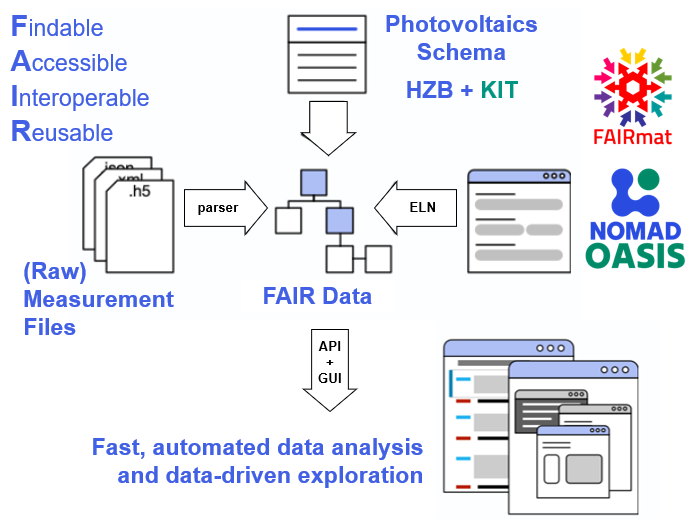

# How does the ELN Work? 

# NOMAD Oasis – System Architecture & Workflow

The NOMAD ecosystem is built around a distributed structure of **local NOMAD Oasis instances** and a **global NOMAD infrastructure**. Each laboratory or institution operates its own Oasis, while data can optionally be shared and integrated into the global NOMAD database.
---
{ .shadow width="1100" } 
---
Within the FAIR data managment, NOMAD provides the base structure, where we can develop our specific classes, materials, parsers and metadata on. With the Voilá script, we can access the structured data via api calls, analyze the data, plot and download them.

## How the System Works

### 1. Local Oasis (Your Laboratory)

Each research group operates an independent NOMAD Oasis instance.

Here researchers can:

- create experiments
- assign **unique entry IDs**
- upload raw measurement or simulation data
- share their data
- analyse their data

---

### 2. Data Upload & Parsing

Once data is uploaded:

- raw files are processed by our self-written parsers
- relevant metadata are automatically extracted from the head lines or by parsing the raw data
- data is normalized into structured formats, that are accessable

This ensures that heterogeneous experimental data becomes **machine-readable and standardized**.

---

### 3. Digital Twin Creation

After parsing your experimental plan, NOMAD generates a structured representation of the experiment:

- experiments are mapped to substrates
- the experimental conditions are linked
- measurement data can be mapped to the substrates
- you get a structure, that creates a digital twin of your sample with all your uploaded measurements

➡️ This results in a **digital twin of the physical experiment**

---

### 4. Global NOMAD Integration

If data is shared externally:

- it is transferred to the global NOMAD infrastructure
- classified into scientific data categories
- indexed for search and reuse

---

### 5. Data Discovery & Reuse

In the local and global system, data becomes:

- searchable
- comparable
- reusable
- linkable across experiments and groups
- we can create a big data basis, but you can decide for each batch, whether you want to share it or not

This enables cross-laboratory collaboration and large-scale data analysis.

---

## Key Concept

!!! info "Core Idea"

    NOMAD connects **local experimental data creation** with a **global standardized research data ecosystem**.

    This allows every experiment to become part of a structured, searchable and reusable scientific knowledge graph.

---
